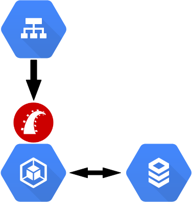

# 無限ステージングの現状
subtitle
: 2018-07-04

subtitle
: 表参道.rb #36

author
: うなすけ

theme
: day-white

# 自己紹介
- 名前 うなすけ
- 株式会社バンク エンジニア
- twitter [@yu\_suke1994](https://twitter.com/yu_suke1994)
- GitHub [@unasuke](https://github.com/unasuke)

{:relative_width="25" align="right" relative_margin_right="-5" relative_margin_top="25"}

# 無限ステージング

それは人類の夢……

# もくじ

- アーキテクチャ
- 無限ステージング実現方法
- 今後の課題

# アーキテクチャ

{:relative_width="50" relative_margin_top="3"}


# アーキテクチャ(超ざっくり)

{:relative_width="42"}

# アーキテクチャ(超ざっくり)

{:relative_width="42"}

# 無限ステージング実現方法

- k8sいっぱい → yamlがいっぱい
  - キツい

# 無限ステージング実現方法

{:relative_width="50" relative_margin_top="3"}

# Helm
> The package manager for Kubernetes
> Helm is the best way to find, share, and use software built for Kubernetes.

[https://helm.sh/](https://helm.sh)

# Helm
- k8sのパッケージマネージャー
  - パッケージマネージャー？
    - aptやdnfのような？
    - k8sで？

# Helm
こんな感じのTemplateに値を埋めてくれる

```yaml
metadata:
  name: {{ .Release.Name }}-ingress
  namespace: {{ .Values.namespace | default .Release.Name }}
```

書式は [https://golang.org/pkg/text/template/](https://golang.org/pkg/text/template/)

# 無限ステージング実現方法

つまり……

1. pull reqができる
1. CIでhelmを叩いて新環境をdeploy
1. 以上

# 今後の課題
1. CIの境構構築
1. リソース枯渇
1. 無限DB

# CIの環境構築
- CIで以下のコマンドが必要
  - gcloud
  - kubectl
  - helm
- インストールしんどい
  - tarを展開して配置している

# リソース枯渇
- DB connection
- compute resource
  - pull reqのcloseをtriggerできてない

# 無限DB
DBは共通のものを使用している

- seedのrestoreができてない

# 無限DB
こんな感じのことがしたい

```
今日の成果は、k8sの無限ステージングのデプロイ時間を
15分->5分(内3分はmysqlのインポート)に短縮できた！
mysqlのdumpをGCSにあげといて、
デプロイ時に対象データ選べるようにした。
```

[https://twitter.com/bigplants/status/1007569733313441792](https://twitter.com/bigplants/status/1007569733313441792)

# さいごに大事なこと
- 実装は僕じゃないです
